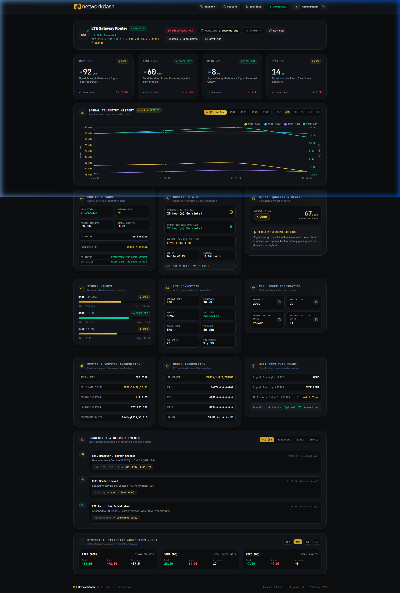
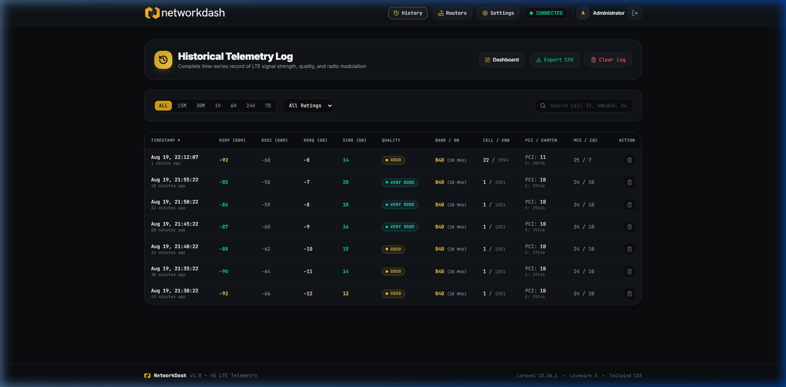
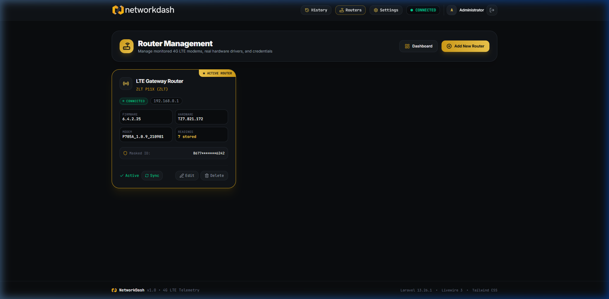

<p align="center">
  
</p>

<p align="center">
  <strong>⚡ Real-Time 4G/LTE Router Signal Telemetry Dashboard & Network Diagnostics Platform</strong>
</p>

<p align="center">
  
  
  
  
  
  
</p>

---

## 🌟 Overview

**NetworkDash** is an enterprise-grade, high-performance web dashboard built with **Laravel 12**, **Livewire 3**, and **Chart.js**. It connects directly to cellular router web gateways (such as **ZLT P11X / Tozed**, Huawei, and standard LTE CPE hardware) to extract, record, and visualize real-time radio frequency telemetry without requiring cloud relays or external services.

Designed with a sleek, modern **cyber-dark Bento Grid** aesthetic, NetworkDash gives network engineers, homelab enthusiasts, and remote workers full visibility over LTE link health, cell tower handovers, and signal cleanliness.

---

## 📸 Screenshots

### 🎛️ Live Bento Dashboard & Multi-Metric Telemetry
> *Granular Drag-and-Drop Bento Grid featuring real-time RSRP, RSSI, RSRQ, and SINR gauges, live multi-series chart, mobile network WAN toggles, and cell tower telemetry.*



---

### 📊 Historical Signal Telemetry & Handovers
> *Filterable historical logs with CSV export, search by Cell ID / eNodeB / Band, and dynamic timeline visualization.*



---

### 📡 Multi-Router Management & Live Connection Testing
> *Connect multiple LTE gateways, test router credentials pre-save, and switch active router views seamlessly.*



---

## 🚀 Key Features

### 1. 📈 Real-Time Radio Signal Telemetry
- **RSRP (Reference Signal Received Power):** Direct signal strength measurement with dynamic threshold rating.
- **RSSI (Received Signal Strength Indicator):** Total carrier power including noise and adjacent channels.
- **RSRQ (Reference Signal Received Quality):** Radio link quality indicator.
- **SINR (Signal-to-Interference-plus-Noise Ratio):** Signal cleanliness metric for bandwidth optimization.
- **★ "All in One" 4-in-1 Combo Graph:** Dual-axis chart plotting Power (`dBm`) and Quality (`dB`) simultaneously with interactive toggle legends and millisecond-accurate local timezone x-axis ticks.

### 2. 🔀 100% Granular Drag & Drop Bento Customizer
- Rearrange **every single individual box** across a 12-column modular grid using **SortableJS**.
- Click **"Drag & Drop Boxes"** to show instant grab handles (`⠿ Move [Box]`).
- Auto-saves layout order to local session and database with a single-click **"Reset Default Order"** button.

### 3. 🌐 Mobile Network Status & Quick WAN Control
- Top-level live WAN connectivity indicator with animated heartbeat pulse.
- One-click **"Connect WAN"** and **"Disconnect WAN"** action buttons communicating directly with router CGI endpoints.

### 4. 🗼 Cell Tower Diagnostics & One-Click Copy
- Diagnostic readouts: **eNodeB ID**, **Local Cell ID**, **Global Cell ID (ECGI)**, **Physical Cell ID (PCI)**, **EARFCN frequency carrier**, and **Operating Band**.
- One-click copy interaction on all diagnostic codes for rapid cell-tower lookup on CellMapper or OpenCelliD.

### 5. 🔔 Automated Connection Event Timeline
- Tracks cell sector handovers, frequency band switches, link drops, and signal degradation in real time.
- Configurable auto-polling engine (10s, 30s, 1m, 5m, or manual).

### 6. 🔒 Privacy-First & Zero Hardcoded Secrets
- All sensitive hardware identifiers (IMEI, IMSI, ICCID, MAC) are masked safely in UI displays.
- Zero tracking, zero telemetry sent to third parties, 100% self-hosted on your local LAN.

---

## 🛠️ Tech Stack

| Layer | Technology |
|---|---|
| **Backend Framework** | Laravel 12 (PHP 8.2+) |
| **Reactive UI Engine** | Livewire 3 (Zero-bundle reactivity & DOM morphing) |
| **Styling & Theme** | Tailwind CSS with custom Bento & Obsidian Dark palette |
| **Interactive Charting** | Chart.js 4.x with custom gradients & dual Y-axis scales |
| **Drag and Drop** | SortableJS |
| **Icons** | Lucide Icons |
| **Supported Databases** | MySQL, SQLite, PostgreSQL, MariaDB |

---

## 🏁 Quick Start Guide

### Prerequisites
- **PHP >= 8.2** with `pdo`, `mbstring`, `openssl`, `curl` extensions.
- **Composer >= 2.x**
- **Node.js >= 18.x** & **NPM**
- A compatible LTE Router connected via Ethernet or Wi-Fi (e.g. `192.168.0.1` or `192.168.8.1`).

---

### Step-by-Step Installation

```bash
# 1. Clone the repository
git clone https://github.com/zatokaa/NetworkDash.git
cd NetworkDash

# 2. Install PHP dependencies
composer install

# 3. Install NPM dependencies & build frontend assets
npm install
npm run build

# 4. Set up environment configuration
cp .env.example .env
php artisan key:generate

# 5. Configure your database in .env (SQLite or MySQL)
# For quick SQLite setup:
touch database/database.sqlite

# 6. Run database migrations & seed default sample data
php artisan migrate --seed

# 7. Start the development server
php artisan serve --port=8000
```

Open your browser and navigate to: **`http://localhost:8000`**

---

### 🔑 Default Demo Login

| Field | Value |
|---|---|
| **Email** | `admin@example.com` |
| **Password** | `admin1234` |

*(You can modify credentials or create new administrator accounts in the Settings panel.)*

---

## 📡 Router Configuration

NetworkDash supports **direct HTTP CGI polling**:

1. Navigate to **Routers** (`/routers`).
2. Click **"Add New Router"**.
3. Select your router driver (e.g., **ZLT P11X / Tozed Gateway**).
4. Enter the Gateway IP (default `192.168.0.1`), username, and password.
5. Click **"Save Router"** — NetworkDash automatically validates the credentials with the hardware before storing!

---

## 📖 LTE Radio Metrics Reference Guide

| Metric | Full Name | Ideal Range | Good Range | Weak / Degraded |
|---|---|---|---|---|
| **RSRP** | Reference Signal Received Power | `>= -80 dBm` | `-80 to -100 dBm` | `< -105 dBm` |
| **SINR** | Signal to Interference & Noise Ratio | `>= 20 dB` | `13 to 20 dB` | `< 5 dB` (High Noise) |
| **RSRQ** | Reference Signal Received Quality | `>= -10 dB` | `-10 to -15 dB` | `< -16 dB` |
| **RSSI** | Received Signal Strength Indicator | `>= -65 dBm` | `-65 to -85 dBm` | `< -90 dBm` |

---

## 🤝 Contributing

Contributions, feature requests, and issue reports are very welcome!

1. Fork the Project (`https://github.com/zatokaa/NetworkDash/fork`)
2. Create your Feature Branch (`git checkout -b feature/AmazingFeature`)
3. Commit your Changes (`git commit -m 'Add some AmazingFeature'`)
4. Push to the Branch (`git push origin feature/AmazingFeature`)
5. Open a Pull Request

---

## 📄 License

Distributed under the **MIT License**. See `LICENSE` for more information.

---

<p align="center">
  Made with ❤️ by <a href="https://github.com/zatokaa"><strong>zatokaa</strong></a>
</p>
